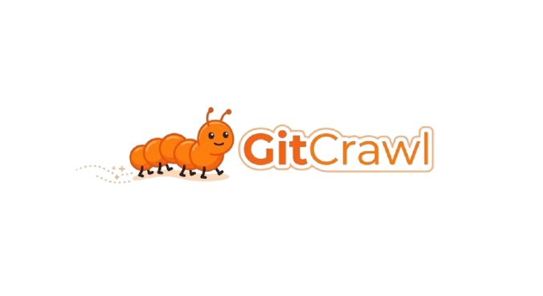
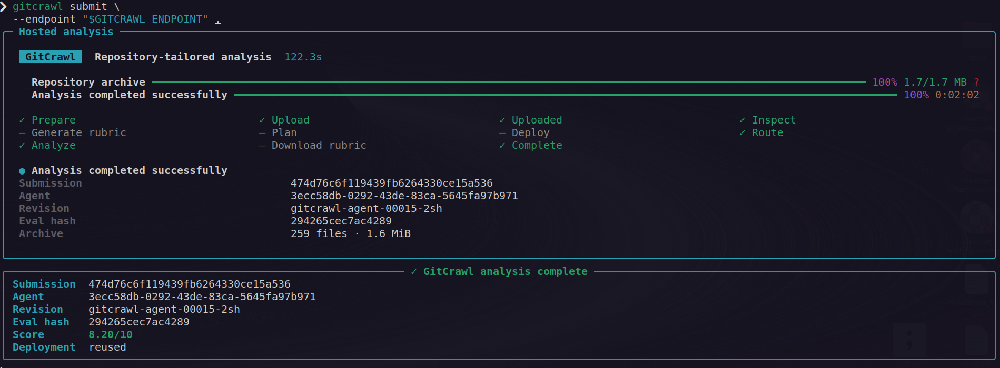

<p align="center"></p>
<br>
<p align="center">
  
  
  
  
  
  
  
  
  
  
  
</p>

# GitCrawl

GitCrawl analyzes a repository against a project-specific rubric. If a repository has no
`eval.md`, Gemini inspects its structure, generates one, creates an approved execution plan, and
deploys an immutable tagged Cloud Run worker. Independent repositories and rubric versions can run
concurrently without changing one another's routing.

## Start here

| Goal | Go to |
|---|---|
| Deploy everything into a GCP project | [Deploy to GCP](#deploy-to-gcp) |
| Analyze a repository using an existing deployment | [Analyze your first repository](#analyze-your-first-repository) |
| Develop or run GitCrawl locally | [Local development](#local-development) |
| Publish a new agent image | [Release a new agent image](#release-a-new-agent-image) |

## Analyze your first repository (recommended)

You need the authenticated control endpoint and an identity granted `roles/run.invoker` on it.

```bash
export GITCRAWL_ENDPOINT="https://YOUR_CONTROL_FUNCTION_URL"
gcloud auth login

cd /path/to/gitcrawl
uv tool install --force .

gitcrawl submit --endpoint "$GITCRAWL_ENDPOINT" /path/to/your/repository
```

For automation or a machine-readable response:

```bash
gitcrawl submit --json \
  --endpoint "$GITCRAWL_ENDPOINT" \
  /path/to/your/repository
```

Interactive terminals use the live dashboard by default. Use `--no-tui` for line-oriented phase
updates, or `--json` for JSON-only automation output.

The first submission normally moves through:

```text
uploaded → inspecting → generating_eval → planning → deploying → routing → analyzing → download → complete
```

After it completes:

```bash
head -n 3 /path/to/your/repository/eval.md
test ! -f /path/to/your/repository/plan.yaml
```

Expected rubric header:

```text
Agent-ID: 123e4567-e89b-42d3-a456-426614174000
# Repository-specific rubric title
Version: 1.0
```

- A generated `eval.md` is downloaded atomically into the repository.
- `plan.yaml` stays versioned in Cloud Storage and is never written locally.
- An unchanged `eval.md` reuses its existing worker but still evaluates the new source.
- An edited `eval.md` keeps the same Agent-ID and creates a new immutable version.
- Submission objects are removed ten minutes after completion; durable agent versions remain.


<br>

## Example (analysing with existing plan)

<p align="center"></p>

<br>
    
## Deploy to GCP

### Prerequisites

- A Google Cloud project with billing enabled.
- Terraform, Docker, `gcloud`, Python 3.12+, and `uv`.
- Credentials able to create IAM, Cloud Run, Cloud Functions, Eventarc, Cloud Tasks, Storage, and
  Artifact Registry resources.
- This repository checked out locally.

Authenticate and set deployment variables:

```bash
export GOOGLE_APPLICATION_CREDENTIALS="/absolute/path/to/terraform-service-account.json"
export PROJECT_ID="your-gcp-project-id"
export REGION="us-central1"
export INVOKER_MEMBER="user:you@example.com"
export REPO_ROOT="/absolute/path/to/gitcrawl"

gcloud auth activate-service-account \
  --key-file="$GOOGLE_APPLICATION_CREDENTIALS"
gcloud config set project "$PROJECT_ID"
```

> Attached service accounts and ADC are preferred in production. Never place credential JSON,
> Gemini API keys, or `.env` files in the container or a submitted repository.

### 1. Create the submission pipeline

`core-infra/` owns the submission bucket, control/analyzer functions, Eventarc trigger, service
accounts, and exact Cloud Tasks cleanup.

The initial apply needs a syntactically valid controller URL. Do not submit repositories until
step 4 replaces this bootstrap value.

```bash
terraform -chdir="$REPO_ROOT/core-infra" init
terraform -chdir="$REPO_ROOT/core-infra" apply \
  -var="project_id=$PROJECT_ID" \
  -var="region=$REGION" \
  -var="invoker_member=$INVOKER_MEMBER" \
  -var="gitcrawl_agent_url=https://bootstrap.invalid"
```

Capture the resources consumed by the extension:

```bash
export SUBMISSIONS_BUCKET="$(terraform -chdir="$REPO_ROOT/core-infra" output -raw submissions_bucket)"
export CONTROL_URL="$(terraform -chdir="$REPO_ROOT/core-infra" output -raw control_url)"
export ANALYZER_SA="build-submit-analyzer@$PROJECT_ID.iam.gserviceaccount.com"
```

### 2. Bootstrap Artifact Registry and publish the image

Create only the registry before an image exists:

```bash
terraform -chdir="$REPO_ROOT/infra" init
terraform -chdir="$REPO_ROOT/infra" apply \
  -target=google_artifact_registry_repository.gitcrawl \
  -target=google_artifact_registry_repository_iam_member.public_reader \
  -var="project_id=$PROJECT_ID" \
  -var="region=$REGION" \
  -var="submissions_bucket_name=$SUBMISSIONS_BUCKET" \
  -var="analyzer_service_account_email=$ANALYZER_SA" \
  -var="invoker_member=serviceAccount:$ANALYZER_SA" \
  -var="image_digest=$REGION-docker.pkg.dev/$PROJECT_ID/gitcrawl/agent@sha256:bootstrap"
```

Build and push:

```bash
export IMAGE_URI="$REGION-docker.pkg.dev/$PROJECT_ID/gitcrawl/agent"
export IMAGE_TAG="0.1.0"

gcloud auth configure-docker "$REGION-docker.pkg.dev"
docker build --platform linux/amd64 -t "$IMAGE_URI:$IMAGE_TAG" "$REPO_ROOT"
docker run --rm --entrypoint python "$IMAGE_URI:$IMAGE_TAG" \
  -c 'from gitcrawl.hosted.app import create_app; print("agent image OK")'
docker push "$IMAGE_URI:$IMAGE_TAG"

export IMAGE_DIGEST="$(
  gcloud artifacts docker images describe "$IMAGE_URI:$IMAGE_TAG" \
    --format='value(image_summary.digest)'
)"
export IMMUTABLE_IMAGE="$IMAGE_URI@$IMAGE_DIGEST"
echo "$IMMUTABLE_IMAGE"
```

### 3. Create the Cloud Run agent service

```bash
terraform -chdir="$REPO_ROOT/infra" plan -out=/tmp/gitcrawl-infra.tfplan \
  -var="project_id=$PROJECT_ID" \
  -var="region=$REGION" \
  -var="submissions_bucket_name=$SUBMISSIONS_BUCKET" \
  -var="analyzer_service_account_email=$ANALYZER_SA" \
  -var="invoker_member=serviceAccount:$ANALYZER_SA" \
  -var="image_digest=$IMMUTABLE_IMAGE"

terraform -chdir="$REPO_ROOT/infra" apply /tmp/gitcrawl-infra.tfplan
export AGENT_URL="$(terraform -chdir="$REPO_ROOT/infra" output -raw agent_url)"
```

### 4. Connect the analyzer to the controller

```bash
terraform -chdir="$REPO_ROOT/core-infra" apply \
  -var="project_id=$PROJECT_ID" \
  -var="region=$REGION" \
  -var="invoker_member=$INVOKER_MEMBER" \
  -var="gitcrawl_agent_url=$AGENT_URL"

export GITCRAWL_ENDPOINT="$CONTROL_URL"
```

Both stacks should now be drift-free:

```bash
terraform -chdir="$REPO_ROOT/core-infra" plan \
  -var="project_id=$PROJECT_ID" \
  -var="region=$REGION" \
  -var="invoker_member=$INVOKER_MEMBER" \
  -var="gitcrawl_agent_url=$AGENT_URL"

terraform -chdir="$REPO_ROOT/infra" plan \
  -var="project_id=$PROJECT_ID" \
  -var="region=$REGION" \
  -var="submissions_bucket_name=$SUBMISSIONS_BUCKET" \
  -var="analyzer_service_account_email=$ANALYZER_SA" \
  -var="invoker_member=serviceAccount:$ANALYZER_SA" \
  -var="image_digest=$IMMUTABLE_IMAGE"
```

Each command should end with `No changes`.

### 5. Submit a repository

```bash
uv tool install --force "$REPO_ROOT"
gitcrawl submit --endpoint "$GITCRAWL_ENDPOINT" /path/to/your/repository
```

## What to verify

### First submission

- The CLI shows upload bytes, elapsed time, and phase transitions.
- The result includes the submission ID, agent UUID, revision, and score.
- `eval.md` exists locally and its first line is a UUIDv4 `Agent-ID`.
- No local `plan.yaml` was created.
- Cloud Storage contains `eval.md`, `plan.yaml`, `manifest.json`, and `active.json` under the UUID.
- The Cloud Run tag points to an explicit revision, not `LATEST`.

### Version behavior

| Submission | Expected behavior |
|---|---|
| No local `eval.md` | Generate rubric, plan, deploy, analyze, download rubric |
| Unchanged `eval.md` | Reuse revision; `planned: false`, `deployed: false` |
| Edited rubric body | Same Agent-ID, new eval hash, plan, and tagged revision |
| Copied `eval.md` | Intentionally reuse that Agent-ID lineage |
| Different repository without `eval.md` | New UUID and independently addressable revision |

### Cloud verification

```bash
gcloud run services describe gitcrawl-agent \
  --project="$PROJECT_ID" --region="$REGION" \
  --format='yaml(spec.traffic,status.traffic)'

export AGENT_ID="$(head -n 1 /path/to/your/repository/eval.md | cut -d' ' -f2)"
gcloud storage cat "gs://$SUBMISSIONS_BUCKET/agents/$AGENT_ID/active.json"
gcloud storage ls "gs://$SUBMISSIONS_BUCKET/agents/$AGENT_ID/versions/**"
```

The controller alone should receive 100% default traffic. Worker tags should reference explicit
revisions at 0% default traffic.

To verify retention, list a completed submission immediately and again after ten minutes:

```bash
gcloud storage ls "gs://$SUBMISSIONS_BUCKET/submissions/SUBMISSION_ID/**"
```

The submission prefix should disappear; `agents/$AGENT_ID/` must remain.

## Architecture

<p align="center"></p>

The authenticated control function issues a signed upload URL. Eventarc invokes the analyzer after
the archive is finalized. The stable Cloud Run controller reconciles the rubric and plan, resolves
an immutable tagged worker, and dispatches `/execute` directly to that tag-specific URL with an ID
token.

Durable state:

```text
agents/<agent-uuid>/active.json
agents/<agent-uuid>/versions/<eval-hash>/eval.md
agents/<agent-uuid>/versions/<eval-hash>/plan.yaml
agents/<agent-uuid>/versions/<eval-hash>/manifest.json
repos/<repository-key>/agent.json
```

Ephemeral state lives under `submissions/<submission-id>/` and is deleted by Cloud Tasks ten
minutes after completion or failure.

## Infrastructure ownership

| Stack | Directory | Owns |
|---|---|---|
| Submission pipeline | `core-infra/` | APIs, buckets, functions, Eventarc, submission IAM, cleanup queue |
| GitCrawl extension | `infra/` | Artifact Registry, Cloud Run service, revision deployer, agent IAM |

The extension references the bucket and analyzer identity through data sources. It must never
recreate or import resources owned by `core-infra/`.

Deployable function sources live under `core-infra/functions/`. `pipeline_functions/` is retained
as testable reference source; keep behavioral changes synchronized.

## Release a new agent image

Build and resolve the new immutable digest using deployment step 2. Then deploy a zero-traffic
controller candidate so existing worker tags remain untouched:

```bash
gcloud run deploy gitcrawl-agent \
  --project="$PROJECT_ID" --region="$REGION" \
  --image="$IMMUTABLE_IMAGE" \
  --no-traffic \
  --remove-env-vars=GITCRAWL_AGENT_ID,GITCRAWL_REPOSITORY_KEY,GITCRAWL_EVAL_HASH,GITCRAWL_PLAN_HASH,GITCRAWL_REVISION_TAG \
  --update-env-vars="GITCRAWL_IMAGE_DIGEST=$IMMUTABLE_IMAGE"

# Use the ready controller revision printed above.
gcloud run services update-traffic gitcrawl-agent \
  --project="$PROJECT_ID" --region="$REGION" \
  --to-revisions="CONTROLLER_REVISION=100"
```

Finally run a normal, untargeted `terraform plan` with the new `image_digest`. Do not use targeted
applies for routine releases.

## Local development

Local planning and evaluation can use Google AI Studio instead of hosted Vertex AI:

```bash
cd /path/to/gitcrawl
uv sync
cp .env.example .env
```

Set `GOOGLE_API_KEY` or `GEMINI_API_KEY` in `.env`. `GITHUB_TOKEN` is optional and enables GitHub
issues, pull requests, contributors, releases, and workflow collectors.

```bash
# Deterministic collectors only; no model calls.
uv run gitcrawl facts owner/repository

# Evaluate with the bundled local rubric and plan.
uv run gitcrawl evaluate https://github.com/owner/repository

# Create and approve a custom local plan.
uv run gitcrawl plan clause.md -o plan.yaml
uv run gitcrawl plan approve plan.yaml
uv run gitcrawl evaluate owner/repository --plan plan.yaml
```

Hosted submissions use `eval.md`; local `clause.md` parsing remains backward compatible.

## How evaluation works

```text
eval.md → deterministic parser → planner → validated/approved plan
        → collectors → evidence agents → pillar scorers
        → hard caps and abstentions → weighted result
```

- Collectors gather repository, CI, test, code, and GitHub facts deterministically.
- Agents answer only questions requiring judgement and receive tools/budgets from the approved plan.
- Evidence citations are checked against files and threads actually opened.
- Code—not the model—enforces hard caps, abstentions, and final arithmetic.

See [rubric guidance](docs/clause.md) and [design details](docs/design.md).

## Development checks

```bash
uv run pytest tests/ -q
uv run ruff check src tests pipeline_functions core-infra/functions
python3 -m unittest discover -s core-infra/tests -v
terraform -chdir=core-infra fmt -check -recursive
terraform -chdir=core-infra validate
terraform -chdir=infra fmt -check -recursive
terraform -chdir=infra validate
```

---

### Developed with ❤️ by [Sai Nivedh](https://github.com/SaiNivedh26)
